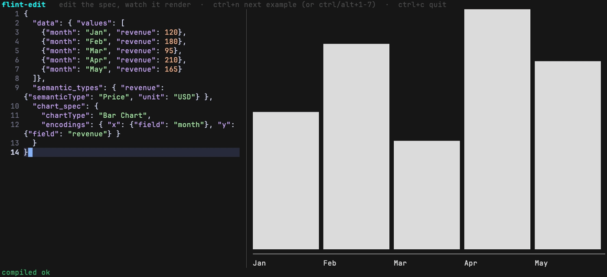

# flint-ntcharts

Compiles [flint-chart](https://github.com/NimbleMarkets/flint-chart) `ChartAssemblyInput`
specs into an [ntcharts](https://github.com/NimbleMarkets/ntcharts) `spec.Spec` envelope —
the flint → ntcharts terminal-UI compile backend. The TypeScript assembly pipeline
(`js/src/ntcharts/`) is bundled into a [Javy](https://github.com/bytecodealliance/javy)/QuickJS
WebAssembly module and run from Go via [wazero](https://github.com/tetratelabs/wazero), so no
Node.js runtime is required at execution time.



*`flint-edit`: a flint spec on the left, its terminal chart on the right, recompiled on every
keystroke. Recorded from [`cmd/flint-edit/demo.tape`](./cmd/flint-edit/demo.tape) with
[VHS](https://github.com/charmbracelet/vhs) — `task gif` regenerates it.*

This started as a Phase 1 feasibility spike proving the wasm approach viable, using a
stand-in Vega-Lite compile as the test payload before the real ntcharts-spec output existed —
that wording is now historical; see [SPIKE-RESULTS.md](./SPIKE-RESULTS.md), a dated go/no-go
record left untouched from that phase. Phase 3 added the pure-TypeScript ntcharts-spec
backend described below, and Phase 4 wired it into the wasm module and the production Go
API (`compile.New` / `compile.Compile`) documented in the Quickstart.

## Quickstart

Install the live chart window and push it a flint document:

```sh
go install github.com/NimbleMarkets/flint-ntcharts/cmd/flint-tui@latest

flint-tui chart.json          # watches the file; re-renders on every save and resize
```

where `chart.json` is any flint `ChartAssemblyInput` — the same JSON you would hand
flint-chart:

```json
{
  "data": { "values": [
    {"product": "Widgets", "revenue": 1250000},
    {"product": "Gadgets", "revenue": 872500},
    {"product": "Doodads", "revenue": 2103000}
  ]},
  "semantic_types": {"revenue": {"semanticType": "Price", "unit": "USD"}},
  "chart_spec": {
    "chartType": "Bar Chart",
    "encodings": {"x": {"field": "product"}, "y": {"field": "revenue"}}
  }
}
```

`cmd/flint-edit` (`go install …/cmd/flint-edit@latest`) is a split-pane playground: edit the
JSON on the left, watch the chart on the right. `ctrl+n` steps through the built-in examples
(bar, time series, candlestick); `ctrl+1`‥`3` / `alt+1`‥`3` jump to one directly in terminals
that deliver those chords.

To work on the repo itself: the compiled `flint.wasm` module and its build provenance
(`compile/flint.wasm.buildinfo`) are committed, so no *build* step (no Javy, no `js/` install)
is needed to run the Go test suite, and [`ntcharts`](https://github.com/NimbleMarkets/ntcharts)
(v2.5.0 or later, the first release with the `spec` package) is an ordinary module
dependency:

```sh
go test ./...
```

### Go API

```go
import (
    "context"

    "github.com/NimbleMarkets/flint-ntcharts/compile"
)

r, err := compile.New(ctx)
if err != nil {
    // handle
}
defer r.Close(ctx)

spec, warnings, err := r.Compile(ctx, chartAssemblyInputJSON, compile.WithBaseSize(80, 24))
if err != nil {
    // handle
}
// spec is a github.com/NimbleMarkets/ntcharts/v2/spec.Spec, ready for spec.Build(spec).
```

- `compile.New(ctx)` compiles the embedded `flint.wasm` once and returns a `*Runner`, safe
  for concurrent `Compile`/`CompileRaw` calls — each call instantiates a fresh, isolated
  module instance. `NewRunner` is a deprecated alias kept for source compatibility.
- `(*Runner).Compile` returns `(spec.Spec, []Warning, error)`; `warnings` is never nil.
  `(*Runner).CompileRaw` returns the raw envelope JSON bytes instead, for callers that want
  to parse it themselves.
- `compile.WithBaseSize(w, h int)` sets `chart_spec.baseSize` (terminal cells) — the
  requested render size. The backend runs with a stretch cap of 1 (see "Default stretch cap"
  below), so this is a hard bound unless paired with `compile.WithCanvasSize(w, h int)`,
  which sets a growth ceiling above `baseSize`.
- `ctx` is honored for cancellation: `New` builds the wazero runtime with
  `WithCloseOnContextDone(true)`, so an already-canceled (or later-canceled) `ctx` aborts the
  compile and `Compile`/`CompileRaw` return a non-nil error instead of a result.

#### Envelope contract

`Compile`/`CompileRaw` parse the same JSON envelope the wasm module (and the Node reference
runner used by `npm run gen-expected`) emit on stdout — frozen as of Phase 4:

```json
{"spec": <NtSpec without any _-prefixed keys>, "warnings": [ChartWarning, ...], "size": {"width": N, "height": N}}
```

`warnings` is always present (possibly `[]`); `size` is always present; key order is exactly
`spec, warnings, size`; the wasm/Node path serializes it with `JSON.stringify` and no
pretty-printing. `spec` is valid input to ntcharts' `spec.Build`.

There are two failure layers, both specified:

1. **Compile-time failure** (e.g. an unsupported chart type). The wasm/Node compiler catches
   this internally, still writes valid JSON to stdout, and exits normally — success vs failure
   is discriminated by the top-level key present, not by process exit status or a thrown
   exception:

   ```json
   {"error": {"message": "Unknown chart type \"Rose Chart\". Supported: ..."}}
   ```

   `CompileRaw` returns these bytes verbatim (no error) — callers that call `CompileRaw`
   directly must check for the `error` key themselves. `Compile` parses the envelope for you
   and, when it finds an `error` key instead of `spec`/`warnings`/`size`, returns a non-nil Go
   `error` built from `error.message` rather than a zero-value `spec.Spec`.
2. **Wasm TRAP** (an engine-level failure, e.g. OOM, or a canceled `ctx` — see above). This
   never produces the JSON envelope at all; it surfaces as a process-level Go `error` from
   `CompileRaw` (and therefore `Compile`) with the module's stderr attached to the error
   message.

### Build provenance

`compile/flint.wasm.buildinfo`, written by `make wasm`, records the Javy version, the
`flint-chart` npm package version, the sha256/byte size of the pre-Javy esbuild bundle, and
the sha256 of the resulting `compile/flint.wasm` itself — enough to check whether the
committed wasm matches a given `js/` checkout without rebuilding it:

```
javy: javy 9.0.0
flint-chart: 0.5.1
bundle-sha256: 91f06b82bef1e6e460b4d038932ea60e2e15595be2b35b8e3dc9cebf0bcb8155
bundle-bytes: 232951
wasm-sha256: b25adf3271b6d60fe1b53d86df8e79e9f25692ada9e633683a9af9e794c57c2e
```

(The values above are a snapshot; the committed file is authoritative.) The bundle is small
because everything imports from the `flint-chart/core` subpath rather than the package root —
the root barrel drags in the Vega-Lite, ECharts, Plotly and Excel backends plus the theme
presets, which quadruples the bundle (about 1 MB at 0.5.1) for code the terminal backend never
calls.

`bundle-sha256` is also re-derived and checked in CI (see "Continuous Integration" below): the
`Wasm provenance check` step rebuilds the esbuild bundle (but not the wasm module itself, no
Javy involved) and asserts its hash matches this file's committed `bundle-sha256`, binding the
committed `flint.wasm` to the committed `js/src/` that's supposed to have produced it.

### Rebuilding the wasm module

If you change `js/src/*.ts`/`js/src/*.js` (or want to reproduce the artifact yourself):

```sh
cd js && npm install
cd ..
make wasm   # downloads bin/javy on first run; picks the right release asset for your OS/arch
```

`make wasm` detects the host OS/architecture via `uname` (macOS/Linux, arm64/x86_64) and
downloads the matching Javy release asset with `gh release download`, then regenerates both
`compile/flint.wasm` and `compile/flint.wasm.buildinfo`. On an unsupported OS/arch, set
`JAVY=/path/to/javy` to point at a pre-installed binary instead.

### Regenerating reference fixtures

The Node-side reference outputs used by the Go parity test live under `testdata/expected/`
(pixel-scale) and `testdata/expected-terminal/` (terminal-scale). To regenerate them from
`flint-chart` directly:

```sh
cd js && npm run gen-expected
```

CI runs this same command and fails the build if it produces a diff (see "Continuous
Integration" below) — regenerate and commit whenever a fixture or backend change should
change the reference output.

## flint-tui

`cmd/flint-tui` builds a persistent terminal chart window: a `bubbletea`/`lipgloss`
program (`tui.Model`, `tui.New(runner)`) that stays open, watching one or more sources
for documents to compile and render, re-fitting the chart to the terminal on every
resize. This is the intended integration point for agents and scripts that want a live
chart rather than a one-shot render: push a new document at any time and the window
updates in place.

```sh
go build -o flint-tui ./cmd/flint-tui

# watch a file (poll interval defaults to 250ms)
flint-tui chart.json
flint-tui --poll 100ms chart.json

# read a stream of JSON documents from stdin
flint-tui --stdin

# listen on a unix socket for document streams
flint-tui --listen /tmp/flint.sock
```

At least one source is required; passing none prints usage to stderr and exits 2.
Sources may be combined (e.g. `flint-tui --stdin --listen /tmp/flint.sock chart.json`)
— whichever source delivers a document most recently is the one on screen. `--stdin`
and `--listen PATH` both accept a stream of back-to-back or NDJSON-style JSON documents
(`encoding/json.Decoder` semantics — pretty-printed or compact, no delimiter required).

### Document sniffing

Each document pushed to `flint-tui`, from any source, is sniffed by its top-level keys
and compiled/built accordingly:

| Top-level key | Document kind | Handling |
| --- | --- | --- |
| `chart_spec` | flint `ChartAssemblyInput` | run through the embedded wasm compiler (`compile.Runner.Compile`), sized to the current terminal via `compile.WithBaseSize` |
| `spec` | a `compile.Compile`/`CompileRaw` envelope | the `spec` field is lifted out and re-sized to the current terminal |
| `type` | a raw `ntcharts/v2/spec.Spec` document | re-sized to the current terminal and built directly |
| `error` | an upstream compiler error envelope (`{"error":{"message"}}`) | the `message` is surfaced verbatim as the render error (status line), same as a compile-time failure from the `chart_spec` path |

Anything else (or invalid JSON) is a sniff error, surfaced on the status line without
discarding whatever chart was on screen already (see below).

### Fit-to-window

The chart is always re-compiled/re-built at `terminal width x (terminal height - 1)`
(one row reserved for the status line) — both on receiving a new document and on every
`tea.WindowSizeMsg` (terminal resize), so an already-displayed chart re-fits without
needing a fresh document push.

### Keys

- `q` or `ctrl+c` — quit

### Status line and error handling

The bottom row always shows `flint-tui · <source> · <width>x<height>`. If the most
recent document failed to sniff, compile, or build, the compiler/validation error is
appended **verbatim (truncated to fit the status line)** and the previously-rendered chart is left on screen (nothing is
blanked out just because the latest push was bad) — so a typo in an agent's next push
never blanks a working dashboard. Non-fatal compiler warnings are shown the same way,
one at a time, when there is no error.

### Agent workflow example

An agent writes the same flint `ChartAssemblyInput` document it would hand to flint-chart
and pushes it at a live `flint-tui` window over its unix socket; `flint-tui` does the
compiling (see "Document sniffing" above — a top-level `chart_spec` key routes it through the
embedded compiler):

```sh
flint-tui --listen /tmp/flint.sock &

nc -U /tmp/flint.sock < chart.json
```

(flint-chart's own MCP server, `flint-chart-mcp`, compiles for its built-in Vega-Lite,
ECharts and Chart.js backends; its output is not something `flint-tui` reads. Send the
*input* document instead.)

Or, for the simplest possible loop (no socket, just a watched file):

```sh
flint-tui watched.json &
# ... later, from anywhere ...
cat chart.json > watched.json
```

## Requirements

- Go >= 1.26.8 (the floor set by `ntcharts` v2.5.0; `wazero` itself needs 1.25)
- Node >= 20
- `gh` CLI on your `PATH` if you need `make wasm` to fetch `bin/javy` (auto-detects
  macOS/Linux, arm64/x86_64 via `uname`; on any other platform, set `JAVY` to a pre-installed
  binary instead)

## Continuous Integration

`.github/workflows/ci.yml` validates the artifacts already committed to the repo on every
push to `main` and every pull request. It does **not** invoke Javy or rebuild `flint.wasm` —
that stays a local/manual `make wasm` step (see "Rebuilding the wasm module" above); running
Javy in CI is a later nicety. In order, the workflow: installs JS deps (`npm ci`),
typechecks and runs the vitest suite (`tsc --noEmit`, `vitest run`), regenerates the
Node-reference fixtures and fails on any diff against the committed
`testdata/expected{,-terminal}/` (reference-drift check), builds the esbuild bundle (`npm
run build`, step "Bundle builds (wasm source)" — a compile-only sanity check, the resulting
bundle isn't Javy-built into a new wasm module), checks that bundle's sha256 against the
`bundle-sha256` committed in `compile/flint.wasm.buildinfo` ("Wasm provenance check" — see
"Build provenance" above; this is what actually binds the committed `js/src/` to the
committed `flint.wasm` without needing Javy in CI), and finally runs `go build ./...`,
`go vet ./...` and `go test ./...`. The Go steps resolve `ntcharts` from its published
module, so there is no sibling checkout to arrange.

To develop against an unreleased `ntcharts`, add a local override without touching `go.mod`:

```sh
go work init . ../ntcharts      # go.work is gitignored
```

## Phase 3: TypeScript → ntcharts-spec backend

Phase 3 adds a second, pure-TypeScript compile path that runs `flint-chart`'s core assembly
pipeline (channel semantics, zero-decision, layout, overflow) and instantiates the result
directly into [ntcharts](https://github.com/NimbleMarkets/ntcharts)'
[`spec.Spec`](https://github.com/NimbleMarkets/ntcharts/blob/v2/spec/spec.go) JSON shape,
instead of a Vega-Lite spec. `assembleNtcharts` (`js/src/ntcharts/assemble.ts`) is the entry
point: given a flint `ChartAssemblyInput`, it runs the shared flint-chart layout phases, then
hands off to a per-chart-type template (`js/src/ntcharts/templates/`) that fills in the
`NtSpec` fields (`type`, `data.series`, `x_axis`, `y_axis`, `heat`, `options`, `theme`).
`chart_spec.title` and `chart_spec.subtitle` pass through to `NtSpec.title` / `subtitle`.

The pinned `flint-chart` version is exact (`0.5.1` in `js/package.json`), not a caret range,
because upstream behaviour moves between minors without a type change: 0.5.1 renamed the
categorical scheme for name-like fields (`set2` → `tableau10`), introduced the `blueorange`
diverging scheme, and changed overflow truncation from "top N by value" to "first N in sort
order". Bumping it is a deliberate step: update the pin, run the suite, review what the
[upstream corpus](#running-the-typescript-test-suite) says changed, regenerate goldens, then
`make wasm`.

### Supported chart types

- Bar Chart
- Stacked Bar Chart
- Line Chart
- Scatter Plot
- Heatmap
- Candlestick Chart
- Sparkline

Only **"Line Chart"** is a registered `chartType` name in the template registry
(`js/src/ntcharts/templates/index.ts`) — there is no separate "Timeseries Line Chart" entry.
`"timeseries"` is instead an **emitted** `NtSpec.type` value: the Line Chart template
(`js/src/ntcharts/templates/line.ts`) inspects the resolved X-channel semantics and sets
`emit.type = "timeseries"` when X is temporal, `"line"` otherwise. Feed it a quantitative
(non-temporal) X field and the same `"Line Chart"` chartType emits `type: "line"` — see the
`line-numeric` fixture/golden under `testdata/fixtures-terminal/` and
`testdata/ntspec-golden-terminal/`.

**Grouped Bar Chart is intentionally unsupported.** ntcharts' terminal `barchart.Model` can only
render stacked segments within a bar, not side-by-side groups, so a multi-series `Spec` with
`options.stacked` unset is rejected by `spec.Build` rather than silently stacked. flint-chart's
grouped-bar encodings have no terminal-renderable equivalent in this backend.

### Cells sizing convention

All sizes in the assembler are interpreted in **cells** (terminal character columns/rows), not
pixels. `resolveBaseSizeShim` (`js/src/ntcharts/shims.ts`) clamps a base size (default 64x20) to
an optional canvas-size ceiling from the chart spec; `deriveStretchCapsShim` derives
`maxStretchX`/`maxStretchY` from the same ceiling so flint-chart's shared layout math stretches
plot regions in cell units. The emitted `NtSpec.width` / `height` are the larger of the layout's
`subplotWidth` / `subplotHeight` and the requested base size, floored at a minimum of 8x4 cells.

**Charts fill the size they were asked for.** For a chart with a continuous X axis (line,
scatter, sparkline, a heatmap with numeric-looking column names) flint's layout shrinks the plot —
its mark-density and aspect-ratio calculation is designed for pixel canvases and returns about 45%
of the requested width — so the emitted size is never allowed below the request. Banded charts
(bars, categorical heatmaps) already fill it; where a `canvasSize` ceiling allows growth, flint's
larger size still wins.

**Default stretch cap is 1 (no growth beyond the base size).** `TERMINAL_OPTIONS.maxStretch`
(`js/src/ntcharts/assemble.ts`) is `1`: when a chart spec sets no `canvasSize` ceiling,
`deriveStretchCapsShim`'s no-ceiling fallback uses this value, so the emitted chart never
exceeds the requested/default `baseSize` (terminal cells are a fixed budget, not a freely
growable canvas). To explicitly allow growth beyond `baseSize`, set `chart_spec.canvasSize`
larger than `baseSize` (or larger than the 64x20 default when `baseSize` is omitted) — the
per-dimension caps `maxStretchX`/`maxStretchY` are then derived from `canvasSize / baseSize`
instead of the `maxStretch` fallback. See `testdata/fixtures-terminal/` /
`testdata/ntspec-golden-terminal/` for goldens that exercise the default (no-ceiling, capped at
the 64x20 base) path.

### Format translation (d3 → Go)

flint-chart's `FormatSpec` (d3-format style) is translated once per axis
(`js/src/ntcharts/format.ts`) into the ntcharts-spec `Format` directive:

- A `prefix` (e.g. `"$"`) becomes `{ kind: "currency", currency, precision }`.
- A `%`-containing pattern becomes `{ kind: "percent", precision }`.
- `abbreviate` becomes `{ kind: "si", precision: 1 }`.
- Any other pattern becomes `{ kind: "number", precision }` (precision 0 for integer patterns
  like `"d"`).
- d3 format **suffixes** have no ntcharts-spec equivalent and are **dropped**, emitting an
  `info`-severity `format-suffix-dropped` warning.

d3 time-format tokens (`%Y`, `%b`, `%d`, ...) are best-effort translated to Go's reference-time
layout tokens (`2006`, `Jan`, `02`, ...) by `d3TimeToGoLayout`; any untranslatable `%`-token is
passed through verbatim with an `info`-severity `time-format-partial` warning.

### Running the TypeScript test suite

```sh
cd js && npx vitest run
```

Beyond the hand-written fixtures under `testdata/`, `js/test/corpus.test.ts` pushes every
case in flint-chart's own test corpus (`flint-chart/test-data`) for each registered chart
type through `compileToNtSpec`, at pixel scale and at the 64x20 terminal default, and
requires a well-formed envelope with no error and no duplicated warning. It is the
"semantic re-vendor guard": an upstream change that breaks a case fails here, before the
wasm rebuild. `js/test/colormap.test.ts` likewise drives flint's colour-scheme recommender
across the whole semantic-type registry and fails on any scheme name `colormap.ts` doesn't
know, so a renamed scheme can't silently fall back to viridis.

To see *what* changed across a `flint-chart` bump when everything still compiles:

```sh
cd js
npm run corpus:dump -- /tmp/before.json
npm install --save-exact flint-chart@<new>
npm run corpus:dump -- /tmp/after.json
diff <(jq -S . /tmp/before.json) <(jq -S . /tmp/after.json)
```

### Cross-validating against the real Go renderer

`speccheck/speccheck_test.go` proves the *other* end of the pipeline: every golden JSON file
emitted by the TS backend — both `testdata/ntspec-golden/*.json` (pixel-scale fixtures, an
explicit `baseSize`) and `testdata/ntspec-golden-terminal/*.json` (terminal-scale fixtures, no
`baseSize`, so `DEFAULT_TERMINAL_BASE` 64x20 applies) — unmarshals into ntcharts' `spec.Spec`,
passes `Validate()`, `Build()`s into a concrete terminal model, and renders a non-empty
`View()`. This is the full flint → TS backend → JSON → Go render contract check, run from Go:

```sh
go test ./speccheck/...
```

The renderer is the published [ntcharts](https://github.com/NimbleMarkets/ntcharts) module
at the version `go.mod` requires, so this check runs anywhere `go test` does, CI included.

### Regenerating the ntcharts-spec goldens

The goldens live under `testdata/ntspec-golden/` (pixel-scale, from `testdata/fixtures/`) and
`testdata/ntspec-golden-terminal/` (terminal-scale, from `testdata/fixtures-terminal/`), and are
produced by `assembleNtcharts` in the vitest suite. To regenerate them after a template or
format change:

```sh
cd js && UPDATE_GOLDEN=1 npx vitest run
```

Goldens additionally carry private `_warnings` / `_width` / `_height` keys (assembly metadata,
not part of the ntcharts-spec schema); the Go side ignores unknown JSON fields, so these are
left in place rather than stripped.

### Known gaps

- **`chart_spec.chartProperties` are not normalized.** Unlike upstream flint-chart, this
  backend does not run `normalizeChartProperties` (it is not exported; see the "Deviations"
  note at the top of `js/src/ntcharts/shims.ts`), so properties are read as given. The ones
  it acts on:
  - `includeZero_y` (`true`/`false`) on line, time-series and scatter charts overrides
    flint's zero-baseline decision; `false` fits the Y axis to the data with 5% padding.
  - `includeZero_y` on a bar chart, and `includeZero_x` anywhere, cannot be honoured (the
    terminal bar model always draws from zero; the X range always follows the data) and
    produce an `info` warning, `chart-property-unsupported`.
  - `logScale_x` / `logScale_y` (`true`) emit `scale: "log"` on the axis: Y on line, scatter,
    time-series and candlestick charts, X on numeric line and scatter charts. A log axis has
    no zero, so flint's zero baseline and fitted domain are dropped and ntcharts widens the
    range to whole decades. Where it cannot be drawn the chart stays linear with a
    `log-scale-unsupported` warning: bars, heatmaps and sparklines; a time X axis; and data
    containing zero or negative values (flint would use a symlog scale; terminal charts have
    none).
  - `candleStyle` (`line` / `block`) on candlestick charts.
- **Bar charts are truncated to what the terminal can draw.** The ntcharts bar model needs
  two cells per bar (the bar and its gap), so a chart `W` cells wide shows at most `W/2`
  categories (`H/2` for horizontal bars). Past that, flint's overflow handling keeps the
  first categories in sort order and the envelope carries one `overflow` warning naming how
  many were omitted.

## License

Released under the [MIT License](./LICENSE.txt).

Copyright (c) 2026 [Neomantra Corp](https://www.neomantra.com).   

----
Made with :heart: and :fire: by the team behind [Nimble.Markets](https://nimble.markets).
